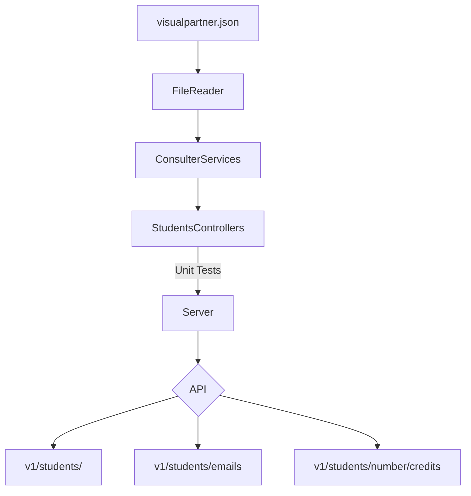

## CODE CHALLANGE PRACTICE 5 FROM WEEKLY_MISSION_4 BACKEND BOOTCAMP LAUNCHX

Requerimientos:

Habilitar un endpoint para consultar todos los estudiantes con todos sus campos.
Habilitar un endpoint para consultar los emails de todos los estudiantes que tengan certificación haveCertification.
Habilitar un endpoint para consultar todos los estudiantes que tengan credits mayor a 500.
Agregar pruebas automatizadas con GitHub Actions.

Dependencies:

1 Express in/for server side
> npm install express --save
✔ in package.json file:
```javascript
"scripts": {
    "server": "node ./lib/server.js"
}
```
2 Jest for testing our code
> npm install jest@26.0.0 --save
✔ in package.json file:
```javascript
"scripts": {
    "test": "node ./node_modules/.bin/jest"
}
```
3 Linter for code styling

> npm install eslint --save
> npm init @eslint/config 
✔ How would you like to use ESLint? · problems
✔ What type of modules does your project use? · commonjs
✔ Which framework does your project use? · none
✔ Does your project use TypeScript? · No / Yes
✔ Where does your code run? · browser
✔ What format do you want your config file to be in? · JavaScript
Successfully created .eslintrc.js file in /Users/hisahito/Desktop/playbookHisahito/weekly_mission_4/code-challenge

✔ in package.json file:
```javascript
"scripts": {
    "linter": "node ./node_modules/eslint/bin/eslint.js .",
    "linter-fix": "node ./node_modules/eslint/bin/eslint.js . --fix",
}
```
✔ in .eslintrc.js file:
```javascript
"rules": {
        indent: ["error", 4],
        "linebreak-style": ["error", "unix"],
        quotes: ["error", "double"],
        semi: ["error", "always"],
    }
```

Se diseñaron


##How this API works:
    This API respond to specific query params for each requeriment and expuse all data in JSON.
    Server is hosting on localhost:3000


#VisualPartnerAPI all students are running in localhost:3000/v1/students


#VisualPartnerAPI all emails from certificated students are running in localhost:3000/v1/students/email


#VisualPartnerAPI all students with credits up to 500 are running in localhost:3000/v1/students/numbers/credits


# hoping this can help anyone in a near future like this helps me today. love.
